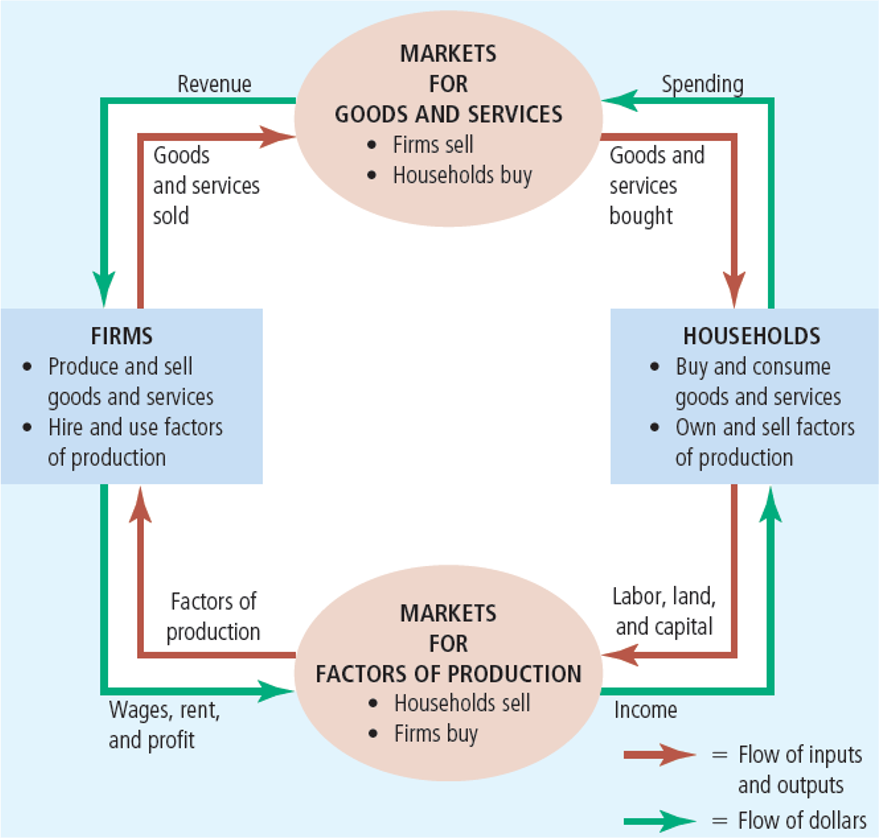
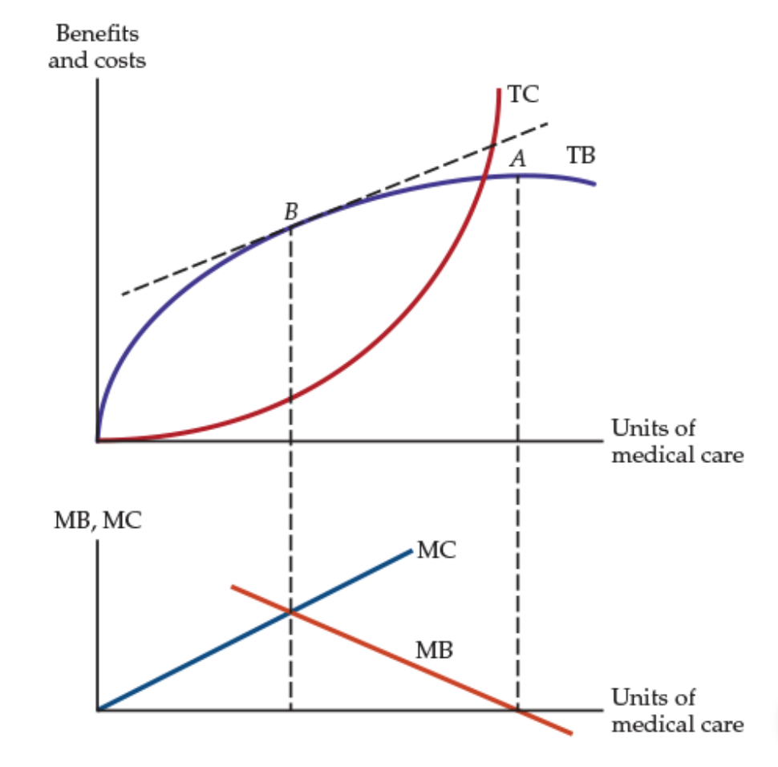
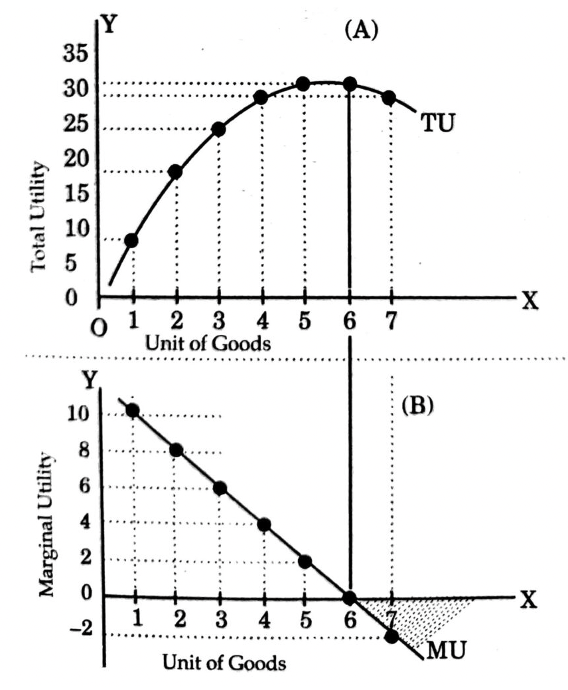
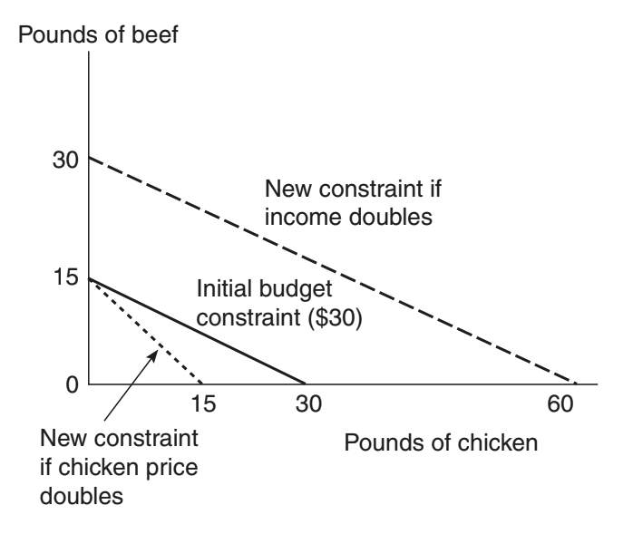
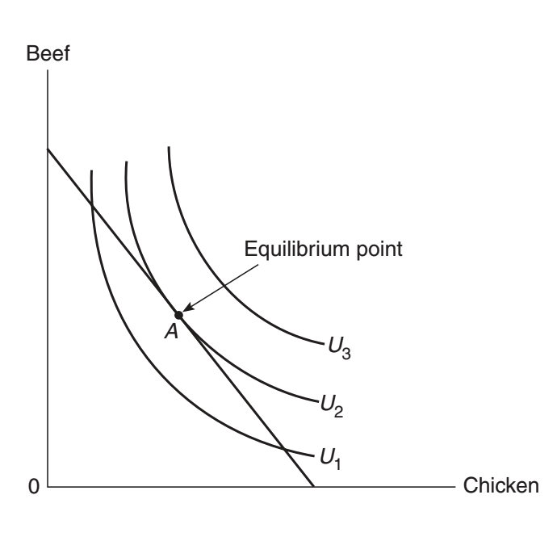
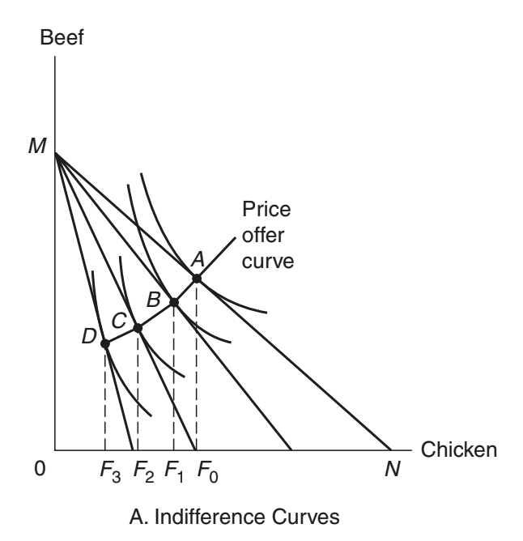
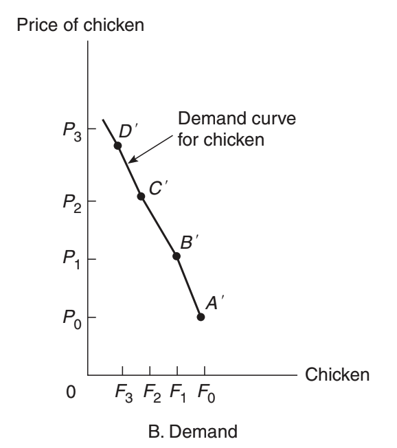
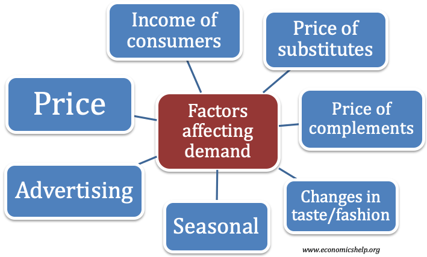
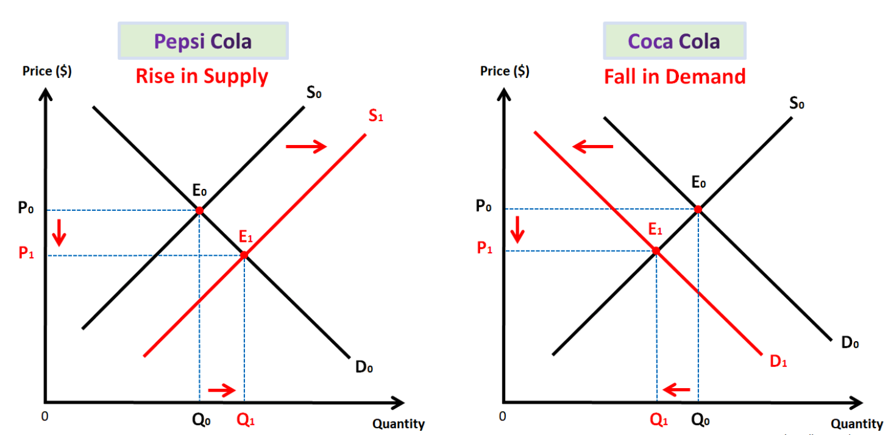

---
format:
  revealjs:
    margin: 0.05
    theme: styles1.scss
    transition: fade
    slide-number: true
    wide: true
    chalkboard: true
    footer: "Introduction to Health Economics | Fall 2026 | Session 2"
    controls: true
    center: true
---

:::{layout="[90,10]"}

:::{first}
[Session 2]{.kicker}

<p class="h1">Economic analysis Part I: Demand and measurement of demand</p>

[Wu Zeng, MD, PHD, Georgetown University]{.label}
:::

:::{first}
<!-- not thing-->
:::
:::

---

```{r setup, include=FALSE}

knitr::opts_chunk$set(echo = FALSE, message = FALSE, warning = FALSE)

```

## Outline 

::::{.two-col-grid}
:::{.grid-item}
<center>

[1]{.accent .n-circle}

Economics approaches
</center>
:::{.bullet-list}
- Study subjects 
- Assumptions
- Model building
- Optimization
:::
:::

:::{.grid-item}

<center>

[2]{.accent .n-circle}

Demand and law of demand 

</center>
:::{.bullet-list}
- Definition of demand
- Law of demand and demand curve
- Shift of demand curve
- Consumer surplus (benefit) to consumers
:::
:::
::::

---

::::{.slide-list}

:::{.list-head}

[Economics]{.kicker}

<div class="rule"></div>

<p class="h2">What is economics</p>

:::

:::{.list-body .bullet-list}
- is the study of human behavior
- is a way of thinking
- provides a systematic way of examining a problem
- provides a rationale for the efficient allocation of scarce resources
:::
::::

---

## Opportunity cost 

Definition: Potential [benefit]{.emcolor} that could have been received if the resources had been used in their [next-best alternative]{.emcolor}

::: incremental

- What are the most difficult decisions you have made? 

- What is the most valuable resource that you have? 

:::

---

## Circular flow of economy

::::{.two-col-grid}
:::{.grid-item}
- Decisions are made by [households]{.emcolor} and [firms]{.emcolor}.
- Households and firms interact in the markets for [goods and services]{.emcolor} (where
households are buyers and firms are sellers) and in the markets for the [factors of production]{.emcolor} (where firms are buyers and households are sellers).
- The outer set of arrows shows the flow of [dollars]{.emcolor}, and the inner set of arrows
shows the corresponding flow of [inputs and outputs]{.emcolor}.
:::
:::{.grid-item}

<centrer>

{fig-align="center" width="80%"}

</center>

:::
::::

---

## Critical assumptions in economics

- Economic analysis is based on [assumptions]{.emcolor}
  - [Scarcity]{.emcolor}, thus we have make choices 
  - When making choices, we are [rational]{.emcolor} and [self-interested]{.emcolor}
    - Maximize utility for consumers
    - Maximize profit for producers
    - [Marginal analysis]{.emcolor} is the key to optimization for decision making
- [Rational Ignorance]{.emcolor}
  - Choosing between alternative actions with [incomplete]{.emcolor} information

---

## The scientific method

- Begins with a [premise]{.emcolor} or [postulate]{.emcolor}
- The scientist observes real-world [phenomena]{.emcolor} events
- A [theory]{.emcolor} is developed
- A [hypothesis]{.emcolor} is formulated
- The [hypothesis]{.emcolor} is tested with data

---

:::{.slide-list}
:::{.list-head}

[Econmic model]{.kicker}

<div class="rule"></div>

<p class="h2">Model building and problem solving</p>

:::
:::{.list-body .bullet-list}
- Goal of economics is to understand, explain, and predict the behavior of decision-makers
- Necessary to simplify that behavior by generalization, constructing a model
- A model is a way of organizing knowledge to make it understandable
- An economic model explains how the economy or part of it, works
- Most microeconomic theory relies heavily on the rationality assumption
- Classifies all decision-makers as optimizers

Example

$$ \text{Number of outpatient visits} = \alpha + \beta * \text{co-payment per visit} $$
:::
:::

---

## Economic Optimization 

`Optimization` is the process of finding the best course of action, given the decision-maker’s goals and objectives.

::::{.two-col-grid}
:::{.grid-item}

- Optimal decision-making
  - Example: Individual will continue to purchase a service as long as the marginal benefits from consumption exceed marginal costs
- Marginal decision-making
  - If MB = MC (equilibrium is reached), no more purchasing/consumption
  - However, [subsidized]{.emcolor} medical care tends to create [overconsumption]{.emcolor}.

:::
:::{.grid-item}

<center>



</center>

:::
::::

---

## Economic Optimization

Economic optimization is a fundamental resource allocation questions, from the producer's perspective, the questions are:

:::{.three-col-grid}
:::{.grid-item}

<center>

[What]{.n-circle} 

do we produce?

</center>
:::
:::{.grid-item}

<center>

[How]{.n-circle}

do we produce it?

</center>

:::
:::{.grid-item}

<center>

[Who]{.n-circle}

gets it

</center>

:::
::::

---

## Marginal analysis 

:::{.three-col-grid}
:::{.grid-item}

[Definition]{.lead .accent}

The study of the consequences of small changes in a variable or variables.
:::
:::{.grid-item}

[Marginal utility]{.lead .accent}

The [change]{.emcolor} in [total utility]{.emcolor} derived from a [one unit increase in consumption]{.emcolor}
:::
:::{.grid-item}

[Marginal product]{.lead .accent}

The [change]{.emcolor} in [total products]{.emcolor} derived from a [one unit increase in input]{.emcolor}
:::
::::

<center> 

> Decision making is mostly based on [margin]{.emcolor} as margin is related to optimization

</center>

---

:::{.slide-list}
:::{.list-head}

[Margin]{.kicker}

<div class="rule"></div>

<p class="h2">Why margin is related to optimization</p>

[From consumer perspective]{.lable}
:::

:::{.list-body}

Assuming you are very thirsty, and would like to purchase ice water to quench thirst. One bottom of ice water cost $2. How many bottle do you want to have? or when will you stop buying the ice water?  

::: {.fragment}

Optimize utility for given budget constraints, consumer would consume the amount of goods till when [marginal utility (Benenfit)]{.emcolor} equals [marginal cost]{.emcolor}

:::

::: {.fragment}

<center> 

### MB = MC 

</center>

:::

::: {.fragment}

> When will you stop eating when having dinner in a buffet restaurant? In this case, what is the marginal cost? 

:::
:::
:::


---

## Marginal thinking 

Marginal thinking is the heart of economics

<center> 

<iframe width="760" height="428" src="https://www.youtube.com/embed/IZm2v9Nl2hY" title="Essential Austrian Economics: Marginal Thinking" frameborder="0" allow="accelerometer; autoplay; clipboard-write; encrypted-media; gyroscope; picture-in-picture; web-share" referrerpolicy="strict-origin-when-cross-origin" allowfullscreen></iframe>

</center>

---

## People make decision based on margins

<center> 

<iframe width="760" height="428" src="https://www.youtube.com/embed/WQdbdPFEwSo" title="Marginal Benefit and Marginal Cost" frameborder="0" allow="accelerometer; autoplay; clipboard-write; encrypted-media; gyroscope; picture-in-picture; web-share" referrerpolicy="strict-origin-when-cross-origin" allowfullscreen></iframe>

</center>

---

## Discussion (3 minutes)

> Please dicuss among yourself and come up with a example that the marginal analysis play a role in your decision making process in your real life.


---

## Demands

<center>

> For any goods and services, we needs to consider both [supply (suppliers)]{.emcolor} and [demand (consumers)]{.emcolor} sides, Let us focus on the [demand side]{.emcolor} first

</center>

---

## Demand

::::{.two-col-grid}

:::{.grid-item}

- Demand 

- Law of demand and demand curve

  - Derivation of demand curve

- Shift of demand surve

- Consumer surplus (benefit) to consumers
:::
:::{.grid-item}

<center>

 

</center>

:::
::::

---

## Demand (consumers)

::::{.two-col-grid}
:::{.grid-item}

::: {.incremental}

- Demand $\stackrel{?}{=}$ want and desire

- Demand $\ne$ want and desire

- Demand $=$ want + [ability/willing to pay]{.emcolor}

- Quantity demanded: Amount of a good that buyers are [willing]{.emcolor} and [able]{.emcolor} to purchase

:::

:::
:::{.grid-item}

<center>

 

</center>

:::
::::

---

## Law of demand and demand curve

::::{.two-col-grid}
:::{.grid-item}
- The Law of Demand
  - There is an [inverse]{.emcolor} relationship between the [amount]{.emcolor} of a commodity that a person will
purchase and the [sacrifice (price)]{.emcolor} that must be made to obtain it
- Changes in price affect the demand relationship in two ways
  - Substitution effect: If the [price goes up]{.emcolor}, people may substitute a [cheaper alternative]{.emcolor} for the good
  - Income effect: Paying higher prices reduces the consumer’s level of [satisfaction]{.emcolor}
:::
:::{.grid-item}

<center>

 

</center>

:::
::::

---

## Demand curve

::::{.two-col-grid}
:::{.grid-item}

Moving [along]{.emcolor} the demand curve from [price]{.emcolor} change of the goods 

Ceteris paribus: holding all other factors constant, the demand curve shows the relationship between the price of a good and the quantity demanded.

:::
:::{.grid-item}

<center>

 

</center>
:::
::::

---

## Why do people consume goods and services (Purchasing oranges and apples)?

<br> <br> 

<center>

[Why do people consume goods and services (Purchasing oranges and apples)?](https://www.mentimeter.com/app/presentation/alkw2zrty4o78kx3wbfjtyspp6bdeqpb/present?question=qvu1usa6j9x1)

</center>


---

## Relationship between consumption and utility 

::::{.two-col-grid}
:::{.grid-item}

[Law of diminishing marginal utility]{.emcolor}

- Diminishing marginal utility: A hypothesis that states that as consumption of a good increases so the marginal utility decreases.

:::
:::{.grid-item}

<center>



</center>

:::
::::

---

::::{.slide-list}
:::{.list-head}

[Derivation]{.kicker}

<div class="rule"></div>

<p class="h2">How the demand curve is derived</p>

:::
:::{.list-body}

[Remember]{.lead .accent}

1. The purpose of the consumption is to get [utility]{.emcolor}

2. Every one has [budget constraints]{.emcolor}

3. People have to make choice about [what to consume]{.emcolor} and its [quantity]{.emcolor}

<br>

<center> 

> The consumers' choice is to [maximize utility]{.emcolor} given the existing [budget constraints]{.emcolor}

</center>

:::
::::

---

## Budget constraints and utility maximization

Assuming only two goods with a fixed income (e.g., Chicken and beef): [Budget line]{.emcolor} and [isoquant]{.emcolor}

::::{.two-col-grid}
:::{.grid-item}



:::
:::{.grid-item}



:::
::::

---

## Change of the price of chicken 

::::{.two-col-grid}
:::{.grid-item}



:::
:::{.grid-item}



:::
::::

---

## Maximization utility for consumers given budget constraint

> Example: A consumer has a budget of $100 to spend on two goods, X and Y. The prices of the goods are $10 for X and $20 for Y. The consumer wants to maximize their utility by choosing the optimal combination of X and Y.

::::{.two-col-grid}
:::{.grid-item}

1. Maximize utility function: U(X, Y) = f(X,Y) = $X^{0.5} * Y^{0.5}$
2. Subject to budget constraint: 10X + 20Y = 100

Then, the graph of the maximization utility for consumers given budget constraint is shown below.

:::
:::{.grid-item}

```{r fig.width=6, fig.height=6, echo=FALSE}
# Load required library
library(ggplot2)

# Define the data range for X
x_vals <- seq(0.1, 10, length.out = 100)

# 1. Budget Line Equation: Y = (100 - 10X) / 20
budget_line <- (100 - 10 * x_vals) / 20

# 2. Indifference Curve (Isoquant) Equation: Y = U^2 / X
# Since max utility U = sqrt(12.5) ~= 3.5355, U^2 = 12.5
indifference_curve <- 12.5 / x_vals

# Combine into a data frame
df <- data.frame(
  X = rep(x_vals, 2),
  Y = c(budget_line, indifference_curve),
  Type = rep(c("Budget Line", "Utility Isoquant (U = 3.54)"), each = 100)
)

# Filter out negative Y values for the budget line to keep the plot clean
df <- df[df$Y >= 0, ]

# Define the optimal consumption point
optimal_point <- data.frame(X = 5, Y = 2.5)

# Create the plot
ggplot() +
  # Plot the lines
  geom_line(data = df, aes(x = X, y = Y, color = Type), size = 1.2) +
  # Plot the optimal point
  geom_point(data = optimal_point, aes(x = X, y = Y), color = "red", size = 4) +
  # Label the optimal point
  geom_text(data = optimal_point, aes(x = X, y = Y, label = "Optimal Point (5, 2.5)"), 
            vjust = -1.5, hjust = 0.3, fontface = "plain") +
  # Formatting axes and labels
  labs(
    title = "Consumer Optimization: Budget Line vs. Utility Isoquant",
    x = "Quantity of X",
    y = "Quantity of Y",
    color = "Legend"
  ) +
  scale_color_manual(values = c("Budget Line" = "blue", "Utility Isoquant (U = 3.54)" = "darkgreen")) +
  scale_x_continuous(limits = c(0, 10), breaks = seq(0, 10, 1)) +
  scale_y_continuous(limits = c(0, 6), breaks = seq(0, 6, 1)) +
  theme_classic() +
  theme(
text = element_text(family = "Helvetica", size = 12),
    plot.title = element_text(face = "plain", size = 14, hjust = 0.5),
    legend.position = "bottom",
    axis.text = element_text(size = 12)
  )
```

:::
::::

---

## Relationship between (marginal) utility and consumption {visibility="hidden"}

:::: columns
:::{.column width="50%"}

#### Total utility and consumption 
```{r echo=F, out.width="80%"}
x <- c(seq(0, 8, 1))
y <- c(0, 8, 15, 21, 26, 30, 33, 35, 36)
c <- c(NA, 8, 7, 6, 5, 4, 3, 2, 1)
d <- c(NA, 2, 3, 4, 5, 6, 7, 8, 9)
dta1 <- data.frame(x, y, c, d)

ggplot(dta1, aes(x=x, y=y)) +
  geom_line() +
  geom_point() +
  labs(x="Consumption", y="Total utility") +
  scale_x_continuous(n.breaks = 8) +
  scale_y_continuous(limits = c(0,40), n.breaks = 8) +
  theme_classic() +
  theme(text = element_text(size=25))

```

:::
::: {.column width="50%"}

#### Marginal utility and consumption
```{r echo=F, out.width="80%"}
ggplot(dta1, aes(x=x, y=c)) +
  geom_line() +
  geom_point() +
  labs(x="Consumption", y="Marginal utility") +
  scale_x_continuous(n.breaks = 8) +
  scale_y_continuous(limits = c(0,10), n.breaks = 8) +
  theme_classic() +
  theme(text = element_text(size=25))
```
- [Diminishing]{.emcolor} marginal utility
:::
::::

---

## Factors influencing the demand for goods or services

Shift in demand curve 

::::{.two-col-grid}
:::{.grid-item}
:::{.incremental}
- Price of related goods 
- The number oand type of people desiring the goods
- Income 
- Preference 
- Expected future price and product availability

:::
:::
:::{.grid-item}
:::{.fragment}



:::
:::
::::

---

## Shift in demand curve

::::{.two-col-grid}
:::{.grid-item}

- [Related goods]{.emcolor}
  - Substitutes: Goods that can be used in [replacement]{.emcolor} of each other (e.g., Coke and Pepsi, butter and margarine, etc.). If the price of one good rises, the demand for its substitute will increase.

  - Complements: Goods that are used [together]{.emcolor} (e.g., cars and gasoline, printers and ink cartridges, etc.). If the price of one good rises, the demand for its complement will decrease.

:::
:::{.grid-item}

::: {.panel-tabset}

### Substitutes




### Complements


:::
:::
::::

---

## Shift in demand curve

::::{.two-col-grid}
:::{.grid-item}

- [Income]{.emcolor}

  - Normal goods: Goods for which [demand increases]{.emcolor} as [income increases]{.emcolor} (e.g., organic food, luxury cars, etc.). If income rises, the demand for normal goods will increase.

  - Inferior goods: Goods for which [demand decreases]{.emcolor} as [income increases]{.emcolor} (e.g., instant noodles, second-hand clothes, etc.). If income rises, the demand for inferior goods will decrease.

:::

:::{.grid-item}

<center>


</center>

:::
::::

---

## Using the two approaches mentioned above to reduce the demand for smoking

::::{.two-col-grid}
:::{.grid-item}

[Moving along the demand curve]{.lead .accent}

- Tax the manufacturer: higher price
- 10% $\uparrow$ in price $\rightarrow$ 4% $\downarrow$ in smoking
- Teenagers: 10% $\uparrow$ in price $\rightarrow$ 12% $\downarrow$ in smoking
:::

:::{.grid-item}

[Shift the demand curve]{.lead .accent}

- Public service announcements
- Mandatory health warnings on cigarette packages
- Prohibition of cigarette advertising on television
- If successful, shift demand curve to the left
:::
:::::

---

## Benefit of consumers as a whole will get: Consumer surplus 

> Consumer surplus: The value placed on goods by consumers minus the cost to the consumers

  <center>
  
  <iframe width="900" height="400" src="https://www.youtube.com/embed/oL20S7c0ZJE" title="What Is Consumer Surplus?" frameborder="0" allow="accelerometer; autoplay; clipboard-write; encrypted-media; gyroscope; picture-in-picture; web-share" referrerpolicy="strict-origin-when-cross-origin" allowfullscreen></iframe>
  
</center>

---

## Measure of demand: Price elasticity of demand

Measure of responsiveness

::::{.two-col-grid}
:::{.grid-item}
Slope

$$slope = \frac{\Delta Q}{\Delta P}$$

:::

:::{.grid-item}
Elasticity (price elasticity of demand) 

$$e = \frac{\Delta \%Q}{\Delta \%P}$$

:::
::::

> The main purpose of using percentage change is to remove the impact from [unit]{.emcolor} differences [across different goods or service]{.emcolor} differences

---

##  Price elasticity of demand (example)

> If the price increase from $10 to $12, the physician visits is reduced from 4 visits per year to 3.5 per year. What is the [price elasticity]{.emcolor} of the demand for physican visits?

. . .

First approach: 

  $$e_D = \frac{\frac{3.5-4}{4}}{\frac{12-10}{10}} = -0.625$$ 

. . .

Some may argue what if the situation is reversed, the price drop from $12 to $10. The visit would increase from 3.5 to 4 visit per year. The elasticity would be: 

. . .

$$e_D = \frac{\frac{4-3.5}{3.5}}{\frac{10-12}{12}} = -0.857$$

Should not they be the same?

. . .

Mid-point approach. 


$$      e_D = \frac{\frac{3.5-4}{(4+3.5)/2}}{\frac{12-10}{(10+12)/2}} = -0.733  $$

----

## Formula for price elasticity of demand

::::{.two-col-grid}
:::{.grid-item}

Elasticity 

$e_d = \frac{\% \Delta Q_D}{\% \Delta P} = \frac{\frac{\Delta Q}{Q}}{\frac{\Delta P}{P}} = \frac{\Delta Q}{\Delta P} * \frac{P}{Q}$

> If you are given a formula for a demand curve, you can compute the elasticity of demand for any combination of price and quantity along that demand curve

:::
:::{.grid-item}

Demand curve $Q = 8- 2P$

```{r fig.width=6, fig.height=6, echo=FALSE}
ggplot(data.frame(x=c(0,8)), aes(x=x)) +
  scale_y_continuous(limits = c(0,8)) +
  labs(x="Q", y="P") + 
  theme_classic() +
  annotate("segment", x=0, xend = 8, y=4, yend = 0, color="red",
           linetype = 2, size=1) +
  annotate("text", x=1, y=4, label="e == - Inf", parse=T, size = 8) +
  annotate("text", x=7, y=0.3, label="e == 0", parse=T, size = 8) +
  annotate("segment", x=0, xend = 4, y=2, yend = 2, color="blue",
           linetype = 2, size=1) +
    annotate("segment", x=4, xend = 4, y=0, yend = 2, color="blue",
           linetype = 2, size=1) +
   annotate("text", x=4, y=2.5, label="e == 1", parse=T, size = 8) +
   theme(text = element_text(font = "Helvetica", size=12),
      axis.ticks.length = unit(-2, "mm"))

```

:::
::::

---

## Inelastic and elastic demand

::::{.two-col-grid}
:::{.grid-item}

- Elastic demand
  - Quantity demanded responds [substantially]{.emcolor} to changes in price
- Inelastic demand
  - Quantity demanded responds only [slightly]{.emcolor} to changes in price
:::
:::{.grid-item}

::: {.panel-tabset}

### Perfect inelastic

```{r echo=FALSE, out.width="100%"}

xyplot <- ggplot(data.frame(x=c(0,100)), aes(x=x)) +
  labs(x="Q", y="P") + 
  theme_classic() +
  theme(axis.text.x=element_blank(),
      axis.text.y=element_blank(),
      text = element_text(size=20),
      axis.ticks.length = unit(-2, "mm"))
xyplot +
  annotate("segment", x=10, xend = 10, y=0, yend = 50, linetype=2, color ="red")
```

elasticity = 0

### Perfect elastic
```{r echo=FALSE, out.width="100%"}
xyplot +
  annotate("segment", x=0, xend = 100, y=50, yend = 50, linetype=2, color ="red")
```
elasticity = $-\infty$

### In between

```{r echo=FALSE, out.width="100%"}
dta2 <- data.frame(x=c(1,2,3), y=c(12,6, 14))
eq1 <- function(x){12/x}

xyplot2 <- ggplot(data.frame(x=c(1,4)), aes(x=x)) +
  labs(x="Q", y="P") + 
  theme_classic() +
  theme(axis.text.x=element_blank(),
      axis.text.y=element_blank(),
      text = element_text(size=20),
      axis.ticks.length = unit(-2, "mm"))

xyplot2 + 
  stat_function(fun = eq1)
```
:::
:::
::::

---

## Determinants of elasticity of demand

:::{.three-col-grid}
:::{.grid-item}

[Availability of close substitutes]{.lead .accent}

- Goods with close [substitutes]{.emcolor}: [more elastic demand]{.emcolor}
:::
:::{.grid-item}

[Necessities versus luxuries]{.lead .accent}

- Necessities: inelastic demand
- Luxuries: elastic demand
:::
:::{.grid-item}

[Time horizon]{.lead .accent}

- Demand is [more elastic]{.emcolor} over [longer]{.emcolor} time horizons
:::
::::

---

## Question test 

> A group of students conducted a survey and found that if the price of banana is incease 
from $0.5 to $0.6 per pound, the consumption of organge would increase from 2 to 2.5 
pounds per month among consumpers. 

What is the banana price elasticity of the demand for orange?

:::{.fragment}

$$e_c = \frac{\%\Delta Q_a}{\%\Delta P_b} = \frac{\frac{Q_{After}-Q_{before}}{(Q_{After}+Q_{before})/2}}{\frac{P_{After}-P_{before}}{(P_{After}+P_{before})/2}} = \frac{\frac{2.5-2}{(2.5+2)/2}}{\frac{0.6-0.5}{(0.6+0.5)/2}} = 1.22$$
:::

:::{.fragment}
> The same group of students also found that if the income of consumers increase by 10%, 
the consumption of orange would increase by 15%. 

  What is the income elasticity of the demand for orange? 
:::
:::{.fragment}
$$e_i = \frac{\%\Delta Q_a}{\%\Delta Income} = \frac{15\%}{10\%} = 1.5 $$ 
:::

---

## Example continue

> A study found that if th global oil price increases by 10%, the supply of oil would increase by 5%. 

What is the price elasticity for the supply of oil? 

:::{.fragment}
$$e_s = \frac{\%\Delta Q_s}{\%\Delta P} = \frac{5\%}{10\%}=0.5$$
:::

---

## Elasticity and health policy 

- Elasticity and tobacco tax 

- Tobacco taxation in Afghanistan

---

## Why economists care about tobacco tax

::::{.two-col-grid}
:::{.grid-item}

Tobacco [is NOT]{.emcolor} like most other products

- Addictive

- Very harmful to users and to others in society
:::
:::{.grid-item}

Tobacco [IS like]{.emcolor} other products

- Its demand responds to

  - price changes relative to the price of other products
  
  - real income changes
  
  - changes in tastes and preferences
  
- We can apply the lessons of economics to reduce its use
:::
::::

---

## Questions and comments {.center}

